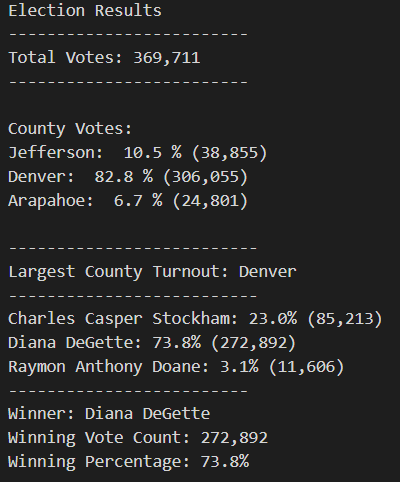

# Election-Analysis
## Ovierview of Election Audit
* To determine the most voted for candidate of the election using tools such as Python and Visual Studio Code to process the raw data.

## Election-Audit Results
* Total Votes: 369 711
  * Breakdown of votes for each county:
    * Denver: 82.8% (306, 055 votes)
    * Jefferson: 10.5% (38, 855 votes) 
    * Arapahoe: 6.7% (24, 801 votes)
  * **Largest County Turnout: Denver, 82.8% (306 055 votes)**


  * Breakdown of votes for each candidate:
    * Diana DeGette: 73.8% (272, 892 votes)
    * Charles Casper Stockham: 23.0% (85, 213 votes)
    * Raymon Anthony Doane: 3.1% (11, 606 votes)
  * **Election Winner: Diana DeGette, 73.8% (272, 892 votes)**



## Election-Audit Summary
* These results were generated using tools such as Python and Visual Studio Code to indentify the overall winner of the election using the data provided from "election_results.csv".
* A business recommendation to the election commission is to recycle this code for future elections.
   * Two Modifications will be needed:
     * Modification 1: Need to modify the path to the new data of the next election
```
# Add a variable to load a file from a path
file_to_load = os.path.join("Resources", "election_results.csv")
```
     
   * Modification 2:
